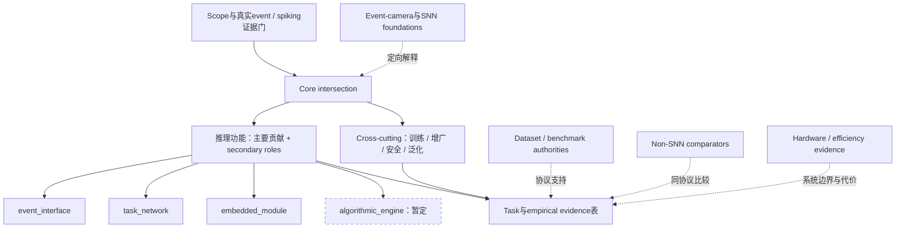

# Taxonomy checkpoint adjudication

> 当前状态更新（2026-09-10）：E1/E2后已发布 **0.2有限扩展冻结版**，G适用域及后续门禁见 [freeze decision](taxonomy-codebook-0.2-freeze-decision.md)。下文保留本阶段当时结论，不把历史“未冻结”当作当前阻塞。

日期：2026-09-10。裁决者：Astra High。输入基线：`5078db6`（完整 SHA 见 schema JSON）。发布 **codebook 0.2，校准版、未冻结**。

**裁决 checkpoint 通过；全量扩展冻结门未通过。** 本次已解决规则问题并完成可逆迁移，可继续最小补充校准；不启动 572 篇标注，不发布 v1.0，不形成最终 taxonomy 或最终 usable corpus。ABN 和 DailyDVS 的来源事实仍未解决，已限制使用并正式 deferred，不能把“PDF 检查结束”称为“事实冲突消失”。

## 1. 输入、计数与证据边界

本次以用户指定的九份 codebook / memo / plan / results / blind / annotations / events / schema 文件为输入，按 canonical paper 汇总全部 30 篇及其 36 配置行，审查决定性证据、历史变更和盲重标。未重新执行 pilot、批量联网抽取或新文献扩展。起始工作树干净，位于当前 local `main`；前一阶段成果已在提交中，不能再把最初设计时的未提交状态当作本次状态。

| 项目 | 从当前文件重算的值 | 解释 |
| --- | ---: | --- |
| candidate / active / reference pool | 572 / 298 / 259 | 仍是旧文献管理层，不是新 usable 数量 |
| canonical pilot / 配置行 | 30 / 36 | EAS-SNN、SDA 各四配置；不是额外六篇文献 |
| PDF resolved / abstract-only | 27 / 3 | 完成的是问题导向检查，不是全文精读认证 |
| scope | 17 core、5 SNN foundation、6 event-camera foundation、2 boundary | 本次均未改变 |
| selection | 22 proposed_usable、5 reference_only、3 excluded | 未提升任何记录为最终 usable |
| 核心写作位置 | 14 inference-role、3 cross-cutting | 四角色不是全部核心论文的穷尽分箱 |
| 核心 primary，裁决后 | interface 4、task 5、module 3、engine 2 | 仅统计 core；全 pilot 的 task=7 包括两个 SNN foundation |
| 历史 audit events → 当前 | 70 → 107 | 追加 5 条 Astra 裁决、32 条版本/trigger 迁移；前 70 条保留 |

历史盲重标是同一 Sol 模型的 intra-annotator stability：scope 10/10、directness 10/10、primary 9/10、extent 10/10、selection 10/10。它不是人类 inter-rater reliability，也不能估计总体准确率。**FLAME 的 embedded_module → event_interface 分歧及 9/10 原始分数不改成 10/10。** 本次裁决不是新的盲测。

仅 ABN 的决定性 credit-assignment evidence ID 原先指向阈值方程，而没有承载冲突原文，因此回看匹配原 SHA256 的官方 PDF p.10 §4.1、p.14 §5，分别补齐两侧证据；没有重读整套 27 篇。FLAME 复用已有 FL-E2、FL-E5 和 blind case 06 的明确 handoff 证据。DailyDVS 的论文冲突已有 DD-E3，本次只作小范围官方更正查找。

## 2. 四项 evidence-ready issue 的裁决

### 2.1 FL-I1：event_interface；不要求跨模型可复用性

**裁决：FLAME 的 LIF Event Attention Layer 为 event_interface；extent 仍为 hybrid_subnetwork。** 它从原始 camera events 产生新的 binary neuronal event trains，经逐 timestamp pooling / flattening 后以 `E_flat(t)` 交给另一个连续 EA-HiPPO principal model。这已经是显式表示 handoff。task-specific、联合训练、没有换 backbone 实验，均不能否定此合同。

0.2 的可复现判定要求同时填写四项事实（完整规则见 codebook §C）：

1. **输入位置**：传感事件或早期事件单元；不是主任务特征之后。
2. **事件组织功能**：neuron dynamics 具体决定事件成员、窗口、聚合表示，或生成有时间/地址或通道语义的新事件列。必须有控制/构造机制；二值激活本身不够。
3. **交接内容和接收者**：写出交付对象、时间索引以及另一个 principal 模型的输入入口。仅有 tensor 名称或层间箭头不够。
4. **独立功能**：原文可定位输入组织/编码模块，随后仍有主特征或推断模块。这里的独立指功能可定义，非独立训练、源码可拆卸或必有跨架构实验。

FLAME 满足四项。timestamp pooling 只整理此交付物，不会自动将它降成普通 feature module。相反，CVPR2025-2047 的四层 PLIF/ASAB 交付内部任务特征；ClearSight 是送往图像融合支路的运动特征；REDIR 是配准和重建之间的内部过滤模块。三者保留 embedded_module，不能仅因在前部、带 pooling、叫 attention 或输出 spikes 就改为 interface。未能证实交接语义时用 unknown + issue，不能以不存在证据替代否定证据。

**重要限制：** 这是有实例约束的规则修订，尚未证明修订后模型间稳定性。FLAME / PLIF-ASAB / REDIR / HsVT 的定向重判是下一阶段的小型规则校准，不能把旧 9/10 当作新合同的验证成绩。

联动修复 **FL-I2**：旧 `representation_form=binary_map` 与 F18“sensor occupancy，不是 neuronal output”的定义矛盾。新增受限的 `neuronal_spike_train`，只用于满足四项合同的接口输出，FLAME 迁移到该值；不能把所有网络隐藏层发放都当 event representation。传感事件与 neuronal spike 仍是不同对象。FL-E3 保留旧推断，FL-A1 / FL-A2 是当前裁决依据。

### 2.2 AB-I1：新增 mlp；不新增 spiking_mlp

**裁决：architecture_family 增加 `mlp`。** 这是已知、可操作的连接家族，继续反复用 other_documented 会制造不必要的例外和模型自由解释。它不是新 role，更不是 neuron / training label。

纳入条件：多层全连接仿射与神经元堆叠构成主体模型，或原文明确提出的独立功能 MLP 模块。ABN 的 spiking MLP 是正例；HsVT 的显式 SpikingMLP 是第二个正例，故同步加 mlp。必须在证据中说明是 whole model 还是哪个组件。

排除条件：单个 linear 投影、普通 Transformer 附带 FFN、点网络例行逐点 MLP，不因内部用了全连接就增加标签。MLP-Mixer 的 token/channel 交互仍用 mixer；只有另有被研究的独立 MLP 才并列。是否 spiking 由 spiking_computation、neuron、signal、boundary 表达；不生成 spiking_mlp、ABN_mlp 等组合词。PPLN 的 other_documented 不能因“也是算子”自动迁移为 mlp。

AB-I1 resolved / astra。HsVT 的同规则迁移记录为 HV-I1，primary=task_network 和 hybrid extent 不变。

### 2.3 AB-I2：保留原文冲突，不制造训练阶段

[ABN 官方论文](https://www.ecva.net/papers/eccv_2024/papers_ECCV/papers/08133.pdf) p.10 §4.1 明确将实验中的 Spiking MLP 训练称为 Spatio-Temporal Backpropagation；p.14 §5 又称实现 ABN 的 spiking MLP 使用 STDP。两处没有给出可对应的不同配置或阶段，实验表中的其他 STDP baseline 也不能自动解释结论。

**主记录：`credit_assignment=unknown`。** 描述论文的实验协议时，优先引用 p.10 的实验声明，同时必须披露 p.14 的冲突；不得将 surrogate_bptt 写成已证实实际训练方案。AB-A2 / AB-A3 分别记录两项声明，AB-A4 记录裁决。

同一矛盾使当前证据不能确定 global training 与 local-adaptive route，`training_route` 同步由 direct_snn 改为 unknown。不是 ANN conversion 的新证据，也不影响已确证的 event-to-spike 输入、task_network、神经阈值机制或 scope。未发现明确 phase/config 对应，不增行，不把 STBP 与 STDP 多选成“联合训练”。

AB-I2 **deferred / astra**；PDF check resolved 表示冲突原文已查到。它不能用于已解决的训练机制分布、STBP/STDP 因果比较或学习成本比较。重新开启条件是正式更正，或与报告实验明确绑定的官方实现/版本证据；本次不以常识、引用文献、软件默认值或作者结论的“可能笔误”消除冲突。

### 2.4 DD-I1：限定引用协议声明，不刊具体 ID

DD-E3 已记录 [DailyDVS 官方论文](https://www.ecva.net/papers/eccv_2024/papers_ECCV/papers/11182.pdf) p.10 §4.1 的两项矛盾：validation/test 都出现 ID 4；8+9+31 与总计 47 不一致。

本次检查作者链接的 [官方 README](https://github.com/QiWang233/DailyDVS-200#testing-set--validation-set) 和公开 open issues（2026-09-10）。README 仍有 validation/test 的 ID 4 重叠，又有 training/test 的 ID 45 重叠，训练列表含 32 项；查到的页面不是可采用的更正。官方 [train_val_test 目录](https://github.com/QiWang233/DailyDVS-200/tree/main/train_val_test) 存在，**本次未审计其逐文件名单**，也没有断言全站没有任何更正。README 矛盾不等于已经证明实际实验发生了数据泄漏。

**裁决：** 保留 event_camera_foundation、dataset_benchmark、evaluation_authority 和 proposed_usable。`dataset_evaluation.setting=unknown`，`split` 明写“author-declared cross-subject；participant separation unresolved”。综述可引用数据规模、采集属性、以及作者声明采用 cross-subject 协议；**不刊未经校正的 ID 或自算的修正 split，也不将表中成绩作为已验证的跨人泛化证据。** 引用该协议的结果时必须限定版本和冲突。

DD-I1 **deferred / astra**。后续只有确需复现该 benchmark 或作定量跨人比较时，才安排 Sol High 对官方 versioned manifests、主体身份去重和论文实验对应关系作小范围核验；名单自洽本身也不证明就是原论文实验版本。没有必要因此重判 dataset authority 或增加第五 role。

## 3. Taxonomy architecture 的总体判断

### 3.1 第一层继续采用 functional role，四支为暂定结构

保留 event_interface / task_network / embedded_module / algorithmic_engine。它们刻画**主要机制贡献中 SNN 在推理时做什么**，不是全部系统的互斥物理拓扑。单篇有多个独立 SNN 职责时保留 secondary；不能因为强制 single-primary 就声称自然界中角色绝不重叠。

相比按 task 分章，检测论文 EAS/SDA、HsVT、PLIF-ASAB 已能展示 interface、task network、embedded feature module 的差别。相比按 architecture 分章，同为 recurrent、conv 或 Transformer 不能说明 SNN 在哪里以及交付什么。因此 role 适合核心交叉章节的第一层，task / dataset / architecture / neuron / training 仍放比较维度。

若只按系统最终主要路径分箱，EAS/SDA 的采样贡献会被 SNN/ANN detector 变体冲散，STLR 的显式求解贡献会消失。因此暂保留“主要机制贡献”选择规则；但没有贡献句、方法结构或消融支持主次时必须 unknown，而不能用作者标题、算子数量或“engine优先”强行决定。

### 3.2 algorithmic_engine：保留为严格受限的 primary hypothesis

当前有两个独立机制证据：Spike Bayesian 的 WTA/EM、STLR 的 SVT/ISTA fixed point。engine 的共同职责是**用spike/state演化实现明确推断变量及求解过程**，不只是“网络能做推理”。其结构比普通 feature extractor 更可解释，暂不全部降为 secondary。

必须同时有：命名的推断目标/变量；spike/state 到变量、更新或解的实质对应；此对应是被提出的推理机制。普通 SGD、attack optimizer、一般 STDP 训练、仅声称 Bayesian-inspired 或 optimization-inspired 均排除。STLR 可以同时有 task_network secondary；若未来某方法的算法对应仅是局部附带解释，应以真正主功能为 primary，算法机制记在 secondary/temporal_mechanism/证据说明。

**可推翻条件：** 补充校准及前两批实际扩展反复只能靠作者用词而非方程/输出合同区分 engine 与 task/module，或没有共同可复现的功能边界，则将 engine 降为 mechanism dimension，并对已有两例做显式迁移。两个正例和一个盲测一致不能证明整个家族已稳定。

### 3.3 图中主干与外围

Foundations 放输入背景/侧栏，non-SNN comparators 放任务/效率比较的对照边，不做 role 叶子。Dataset/benchmark 提供评估底座，没有 SNN role。Hardware/evaluation 是可跨所有 role 的证据层；真实 sensor-chip co-design 如同时构成方法性 event-SNN 耦合，仍按其推理职责归主分支，再标 hardware_system 和 measurement boundary，不提前建“hardware role”。未处理 event-camera 的 SNN chip 是 foundation，非SNN设备测量是 comparator。

## 4. 可执行的核心章节树

下表是**pilot 支撑的写作结构**，不是新增 CSV controlled labels。第一层严格对应四个 primary roles；第二层是分支内部的交付合同/协作方式。它们可指导分组检索与章节安排，但未完成补充校准前不要求执行模型强填新的二级类别，不能把表中的中文短标题写进 enum。

| 第一层 → 第二层 | 纳入判据 | 排除邻界 | Pilot 代表及定位证据 |
| --- | --- | --- | --- |
| Event interface → 边界控制 | SNN交付结束窗口/保留事件的控制，下游另构表示 | 已给出完整表示者看后两支；固定非SNN slicing不是本支 | SpikeSlicer NeurIPS2024-2388，SS-E2 |
| Event interface → 选择与聚合表示 | 发放改变事件贡献/局部区间并形成下游输入tensor | 普通SNN隐藏feature及连续ANN aggregation不属此支 | EAS-SNN ECCV2024-1168，EA-E2；SDA CVPR2026-1873，SD-E2 |
| Event interface → 新neuronal event train编码 | 时间/地址语义的新发放列作为后续principal模型输入；I1–I4齐全 | sensor binary occupancy、rate编码仅作固定预处理、普通层间spikes | FLAME NeurIPS2025-0641，FL-E2 / FL-A1；该二级分支仅一例，保留校准性质 |
| Task network → Event输入的主要特征与预测路径 | SNN贯穿主要任务特征路径；允许连续head或多阶段ANN/SNN交替 | 独立sampler不能因接SNN detector便归此primary；局部前端/支路看module | SpikePoint ICLR2024-1097，SP-E2；ABN ECCV2024-0096；event SpikeTrack CVPR2026-1798，ET-E1；HsVT ICML2025-2762，HV-E2 |
| Task network → 联合多模态主要推断 | 两种真实输入模态在主要spiking特征/融合路径中联合推断 | RGB teacher仅训练不是本支；只有event SNN辅助ANN图像主路看module | SpikeFET NeurIPS2025-4041，SF-E1；不是仅凭modalities自动入本支 |
| Embedded module → 串行局部特征/时间过滤 | SNN为连续任务系统的局部feature、filter或memory职责，且不满足interface合同 | 另有明确event表示交接看interface；多阶段共同主干看task | PLIF-ASAB hybrid CVPR2025-2047，AH-E2；REDIR ECCV2024-1737，RD-E1/2 |
| Embedded module → 支路与跨模态条件化 | 局部SNN motion/features/neuronal state受另一支路调控，再进入连续融合/重建 | 整个联合主推断已经spiking看task-network multimodal支；只有不同event表示不算多模态 | ClearSight ICCV2025-1790，CS-E1/2 |
| Algorithmic engine → 概率竞争与在线参数推断 | spike assignment与局部更新对应显式latent responsibilities/算法参数 | 一般分类器竞争或离线STDP特征训练不充分 | Spike Bayesian NeurIPS2024-1436，BC-E1 |
| Algorithmic engine → 固定点/展开latent coding | 神经状态、发放率等实现明确求解过程，输出用于下游推断 | 单纯重复T步、decoder里有neuron、ISTA灵感命名不充分 | STLR ECCV2024-1778，ST-E2；decoder另记secondary task_network |

二级分支不声称全局穷尽或完全互斥：例如控制加聚合以实际交付物归组织位置，多模态task以主要联合路径优先，其余architecture/purity从表中查询。同一paper用一次主叙述加交叉引用，避免重复介绍。独立spiking head、routing、memory若未来出现，可以落既有embedded role及snn_module_functions；目前没有足够独立pilot例子为它们开独立二级大节。真graph SNN也先按功能归类，graph在架构/表示表中体现。

核心旁设 **Cross-cutting learning and reliability**：

- **训练与表示/时间共同优化**：EventRPG 的 SLTRP/SLRP + augmentation；EAS/SDA 的训练机制作为其主推理章节的交叉引用。纯训练新论文不虚构新 role。
- **安全、时间扰动与泛化**：raw-event attack（ECCV2024-1740）与 input-grid retiming（ICLR2026-1286）分清威胁对象、预算、时钟及victim；augmentation不自动算robustness证据。一般generic robustness仍需通过intersection门。
- **Conversion与部署条件**：conversion保持training_route。CVPR2025-0053仅为SNN foundation，不能当event-specific conversion已校准。真实event-specific conversion若没有新推理职责归cross-cutting；若同时提出新系统，依其主要推理功能分支并保留训练轴。

正交表统一记录：scope/directness、输入来源/模态、temporal organization、representation form/properties/learning、event-to-spike interface、secondary roles/module functions、boundary map/extent/signal、architecture/neuron/state、三个时间轴/reset/lookahead、training route/learning signal/credit assignment、task/output、dataset/version/split/config、efficiency类型/硬件范围/成本分母、robustness威胁/分布、source/nature/confidence及具体survey use。不得把未知值写成零成本，或把局部芯片数字称为全管线节能。

建议篇幅保持 memo 的 6% introduction、14%定向基础、58%核心（其中约46%推理role、12%cross-cutting）、12%任务/实证、10%开放问题/结论；这是总和100%的讨论起点，不是按论文数配页。150–180篇仍按独立论证作用裁剪，没有scope配额；authority/comparator能成为usable，非core不是排除的充分理由。

## 5. 0.2、迁移和质量处置

选择发布 **0.2**，不保留停滞的0.1，也不冻结v1.0。0.1的主要问题已有可操作修订，但新handoff合同尚未进行修订后盲判，未覆盖的方法家族也不能从图ANN与generic SNN的拼接中“推定已覆盖”。

同步产物：codebook、59列CSV模板的伴随JSON契约、受影响annotations、append-only events、tracked validator、migration文档、memo、results。本次CSV header没有变，不添加伪论文schema行；JSON契约承载两个新标签、当前版本、嵌套词表和历史快照校验。旧 work/validator 保留为历史运行文件，当前命令改用 scripts/validate_taxonomy_pilot.py。

发现六种未经批准的trigger拼写，共影响八行；全部映射回既有trigger，不扩张trigger词表。新validator检查nested enums、schema/codebook镜像、evidence ID、主图scope门、engine/interface约束、history完整性，以及反向迁移能否恢复原0.1逐字段值。**验证器通过不等于所有方法语义都已终审。** 旧记录部分非决定性字段仍有宽泛证据locator/other_documented例外，需要在成为最终表格证据前补准；尤其conversion不因权重校准自动视为distillation：CVPR2025-0053原learning_signal=distillation仅连接到转换/校准证据CV-E1，本次保守改为unknown，新增CV-I1（deferred / astra；下一次具体查证由Sol High准备）。不推断另一种监督，也不改变已确认的ann_to_snn路线。这项补充一致性裁决不是第五项原evidence-ready issue。这里没有借checkpoint名义重抽整套59字段。

四项原issue：FL-I1、AB-I1 resolved；AB-I2、DD-I1 deferred。另有FL-I2和HV-I1两项联动规则记录。所有受裁决的五篇使用astra_adjudicated，标明审查字段范围；版本/trigger规范化的其他记录保留原Sol review状态。旧FLAME推断、blind CSV/报告及70条历史事件保持可追溯；不用新规则改写历史agreement。

## 6. 冻结前最小补充校准

只要求以下**六个证据槽位，最多六篇新增canonical论文**；一篇满足多个槽位可合并，按最少去重论文数选取。当前只给需求，不检索/下载/标注这些新论文，不启动全量工作。

| 槽位 | 最小样本资格 | 只须解决的问题 | 不合格替代 |
| --- | --- | --- | --- |
| G | 真实contrast-event图与spiking message passing/神经元共同构成方法的1例 | 图构造成本、边上传什么、neuron在哪里、role/boundary合同 | 非SNN event GNN + 非camera SpikeGCL拼成正例 |
| C | event-specific ANN-to-SNN conversion的1例 | ANN训练输入、转换/校准/finetune、event时间映射、残留连续算子、推理职责是否真的改变 | generic conversion论文或integer-train/spike-infer |
| F | 经典event-SNN optical-flow方法的1例 | motion/flow计算由SNN承担何职责、连续warping/head范围、物理时间对simulation T | pilot的非SNN event-graph flow comparator |
| D | 较早event-SNN depth方法的1例 | depth/disparity输出、编码和数值readout、SNN是否主路径 | on-device ConvGRU depth comparator |
| P | 较早event-SNN pose方法的1例 | pose对象、时序/模态接口、SNN功能和head边界 | 非SNN PEPNet，或仅在DHP19上泛用SNN测试 |
| H | 真实sensor–spiking-chip系统共同设计的1例 | 在线输入与host关系、测量覆盖范围、sensor/host/I/O/芯片成本、无传统backbone时role能否表达 | 只把4层SNN搬到芯片的局部测量或模拟投影 |

先从现有classic pool、Core bibliography、参考综述已定位引用寻找；只为填槽做定向回溯。找不到合格正例时报告检查过的候选与失败理由，不能创造“可能存在”的gold样本，也不能为维持大类而扩大检索。某槽位被证明在所查来源没有可得正例，不等于该家族不存在；Astra可通过明确适用域及unknown路由决定是否允许有限扩展冻结。

同时仅对 **FLAME、CVPR2025-2047、REDIR、HsVT、STLR** 五个既有case做受影响字段的定向重判：隐藏本裁决标签后填写合同/排除理由，复用原PDF定位，新增事实问题才回PDF。检查interface/module、distributed task/module、engine/task三组相邻关系；再对ABN/HsVT的mlp映射做一次规则检查，无需30篇重跑。

冻结门：这些槽位均获事实答案或Astra明确的适用域限制；新合同的五例裁决无未解释分歧；没有必须新增primary才能表达的方法；新标签/嵌套词表可复现；所有scope/role/extent关键问题已解决或对应记录暂不作主图证据。AB/DD的非主role来源冲突可保留deferred，但相关表格用途必须继续受限。不能为了critical issue清零把deferred重命名为resolved。

## 7. 下一阶段工作流与停止边界

1. **Sol High**：完成上述最小校准，处理原文问题、补充证据、困难纳排建议和五例定向重判。不能自行增标签，不能顺手扩成572篇；当前30篇不从头再做。新增样本计划写独立calibration表及报告，复用0.2契约；原30篇/36行pilot与baseline保持独立，定向重判保留旧值和新判断。
2. **Astra High**：审查新合同稳定性、覆盖失败及engine的必要性，决定第一个允许扩展的冻结版本和适用域；如修规则，提供migration与受影响ID，不以agreement门槛代替判断。
3. **冻结后 Sol Mid / High**：Mid按40–50篇处理完整标题/摘要、clear cases、metadata、只读验证与coverage；High处理核心方法、全部具体PDF触发及难例证据。全候选起点仍为572，不限298。必须顺序交接写入，避免同工作树并发修改。
4. **Astra checkpoints**：第一批后及约150/300/450条检查scope×role×representation、unknown、来源年代、排除理由、family去重与成本；必要时修订版本，不追求150–180硬配额。
5. **最后 Astra High**：完整候选与补充回溯形成claim ledger后，决定final taxonomy、outline和usable裁剪；复杂冲突才考虑单次xhigh。

本轮止于裁决、验证及本地commit。没有修改旧Survey/Advisor membership、V2、outline或generated views，没有批量论文抽取，没有push。详细迁移与验证记录见 [0.2 migration](taxonomy-codebook-migration-0.2.md)。
